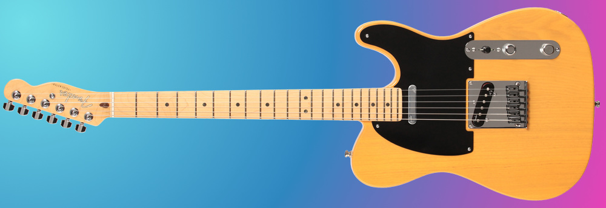

# Guitar + JavaScript

This tutorial shows how to create a guitar in JavaScript. All code on this page is MIT licensed. The source code [can be found here](https://github.com/ronyeh/guitar/). Here is a [basic demo](https://squarepoet.github.io/guitar/v1) of what we will build together. It will eventually look similar to the image below:




## Audio

First, we will need to play individual notes from our virtual guitar. We can use a JS library for this. Here are two that are easy to use:
* Musical
* Tone

Synthesizing a guitar string is an advanced topic for another day. For now, we will use audio sampled from a real guitar. Our sample files were recorded from a Fender Telecaster.

```js
// TODO
alert('Hello World');
```

## Graphics

Let's make some graphics for our guitar. We will can use SVG to draw shapes for the body and neck of the guitar. If you want to skip this step, feel free to [download this JPEG](i/tele.jpg) to use as a background image for your guitar.

```js
// TODO
alert('Hello World');
```

## Interaction

Now we need to support user interaction with the guitar. We can do this by detecting mouse and keyboard events (or touch events on a mobile device).

```js
// TODO
alert('Hello World');
```


### See
* [JS Piano](https://piano.js.org)
* [JS Music Theory](https://music.js.org)

### More Resources
* https://gym.pencilcode.net/ref/play.html
* https://gym.pencilcode.net/jam/#/jam/twinkle.html